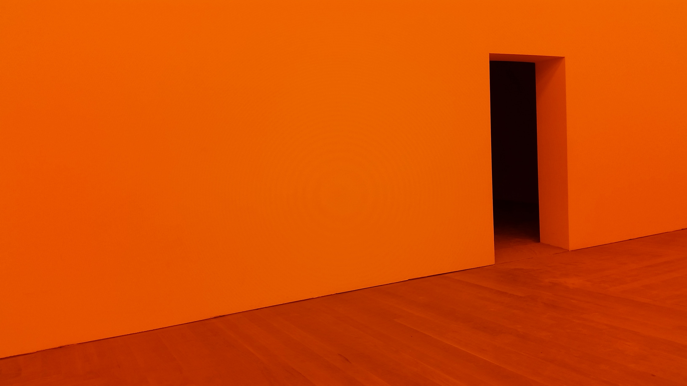
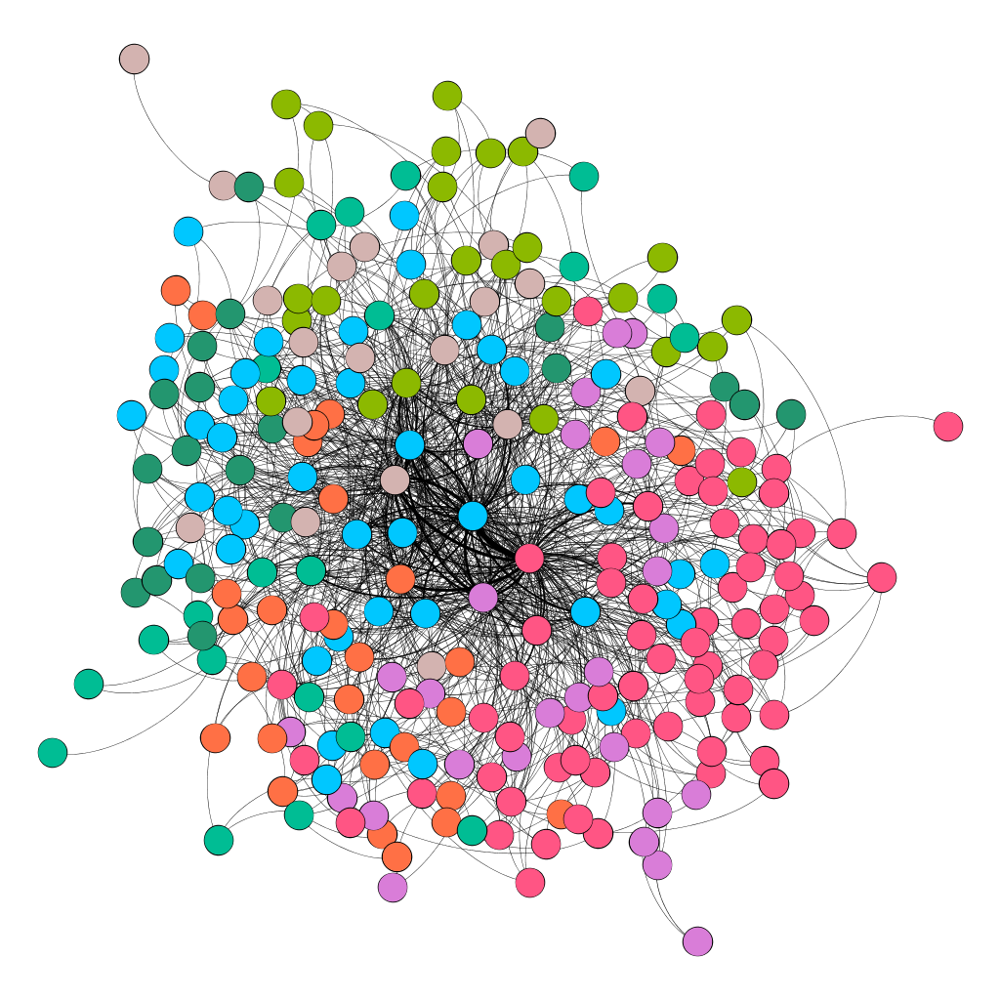

```{r setup, include=FALSE}
usethis::use_git_ignore(c("*.csv", "*.rds"))
options(htmltools.dir.version = FALSE)

# see options for customize slides: 
# https://slides.yihui.name/xaringan/
# https://slides.yihui.name/xaringan/incremental.html
# https://github.com/yihui/xaringan/wiki

library(knitr)
library(tidyverse)
library(xaringan)
```

class: inverse, center, middle

**Access our slide deck here:**  
https://bretsw.github.io/csed-se-slides/

--

**Follow us on Twitter:**  
[@bretsw](https://twitter.com/bretsw) and [@suk_moudgalya](https://twitter.com/suk_moudgalya)

---

# Singletons

- Computer Science teacher singletons (Yadav, Gretter, Hambrush, & Sands, 2017)
- Sparse face-to-face networks for computing resources (Mazur & Woodland, 2018)

```{r, out.width = "720px", echo = FALSE, fig.align = "center"}
include_graphics("img/singleton.jpg")
```

---

# Online Professional Learning

- Seeking help online  (Hur & Brush, 2009)

```{r, out.width = "720px", echo = FALSE, fig.align = "center"}
include_graphics("img/help.jpg")
```

---

class: inverse, center, middle

# Stack Exchange

*"Stack Exchange is a network of 174 communities that are created and run by experts and enthusiasts like you who are passionate about a specific topic. We build libraries of high-quality questions and answers, focused on each community's area of expertise"*

---

class: inverse, center, middle

# CSEd SE

**Computer Science Educators Stack Exchange**  
https://cseducators.stackexchange.com/

*"Q&A for those involved in the field of teaching Computer Science"*

---

# CSEd SE

### Key Features
- Questions and Tags

--

- Interactions
  - Responding (i.e., answering to questions)
  - Commenting 
  - Voting

--

- Membership
  - Membership roles (e.g., moderators)
  - Reputation badges
  - Real identity

---

class: inverse, center, middle

# Framework

---

class: inverse, center, top

# Community

```{r, out.width = "720px", echo = FALSE, fig.align = "center"}
include_graphics("img/community.jpg")
```

---

class: inverse, center, top

# Network

```{r, out.width = "720px", echo = FALSE, fig.align = "center"}
include_graphics("img/network.jpg")
```

---

class: inverse, center, top

# Space

```{r, out.width = "720px", echo = FALSE, fig.align = "center"}

```

---

class: inverse, center, middle

# Purpose

Describe contributors’ participation and learning in CSEd SE  
with the frameworks of communities, networks, and spaces in mind.

---

# Research Questions

1. How are CSEd SE contributors using the forum?
1. What are the characteristics of CSEd SE's highly-connected contributors?
1. Do CSEd SE's highly-connected contributors tend to interact with some fellow contributors more than others?

```{r, out.width = "720px", echo = FALSE, fig.align = "center"}
include_graphics("img/question.jpg")
```

---

class: inverse, center, middle

# Results

---

# Results

### RQ1. How are CSEd SE contributors using the forum?

*May 2017 - June 2018*:
- 559 questions from 210 users

--

- 2,675 responses to these questions from 675 different users.

---

# Results

### RQ2. What are the characteristics of CSEd SE's highly-connected contributors?

*highly-connected contributors* = at least 3 interactions with fellow users

--

```{r rq1_stats, eval=TRUE, echo= FALSE, message=FALSE}
library(tidyverse)
library(igraph)
csed_graph <- readRDS("data/csed_graph.rds")
csed_degree <- csed_graph %>% vertex_attr(name='degree')
csed_in_degree <- csed_graph %>% vertex_attr(name='in_degree')
csed_out_degree <- csed_graph %>% vertex_attr(name='out_degree')

stats_degree <- c(mean(csed_degree), sd(csed_degree), 
                  median(csed_degree), range(csed_degree)
                  ) %>% round(2)
stats_in_degree <- c(mean(csed_in_degree), sd(csed_in_degree), 
                     median(csed_in_degree), range(csed_in_degree)
                     ) %>% round(2)
stats_out_degree <- c(mean(csed_out_degree), sd(csed_out_degree), 
                      median(csed_out_degree), range(csed_out_degree)
                      ) %>% round(2)
stats_summary <- stats_degree %>% cbind(stats_in_degree) %>% cbind(stats_out_degree)
colnames(stats_summary) <- c("Degree", "In-Degree", "Out-Degree")
rownames(stats_summary) <- c("mean: ", "SD: ", "median: ", "min: ", "max: ")

knitr::kable(stats_summary, format = "html")
```

---

# Results

### RQ3. Do CSEd SE's highly-connected contributors tend to interact with some fellow contributors more than others?

*Spinglass clustering algorithm*:
- Internal links and external non-links: YES! 
- External links and internal non-links: NO!

```{r, out.width = "480px", echo = FALSE, fig.align = "center"}

```

---

class: inverse, center, top

# Clusters

```{r, out.width = "600px", echo = FALSE, fig.align = "center"}

```

---

# Results

### RQ3. Do CSEd SE's highly-connected contributors tend to interact with some fellow contributors more than others?

*Results of quantitative analysis*: 
- statistically significant evidence of clustering
- 8 clusters (2 very small)
- 6 larger cluster ranged in size from 23 to 53 members

--

*Results of qualitative coding the 6 larger clusters*:  
- each contained at least some questions and answers related to lesson ideas and curriculum design
- various topics:
  1. teaching high school students, 
  1. teaching undergraduates
  1. labs
  1. web development
  1. best practices
  1. student motivation

---

class: inverse, center, middle

# Significance

---

# Significance

### Messy

CSEd SE demonstrated some community qualities and some network qualities,  
but did not neatly fit either framework.

```{r, out.width = "600px", echo = FALSE, fig.align = "center"}
include_graphics("img/mess.jpg")
```

---

# Significance

### Community

- democratic participation qualities
  - elected moderators
  - upvoting and downvoting questions and answers
  - user-generated question-and-answer tags
  - cluster topics not being dictated by the most active contributors

*Can communities exist in online discussion forums?*

```{r, out.width = "480px", echo = FALSE, fig.align = "center"}
include_graphics("img/community.jpg")
```

---

# Significance

### Network
- participation inequality
- diversity in participation even among highly-connected contributors
- overlap and interconnection of clusters
- diversity in terms of professions and locations of the members

*What are different ways of identifying "experts" in online discussion forums?*

```{r, out.width = "480px", echo = FALSE, fig.align = "center"}
include_graphics("img/network.jpg")
```

---

# Significance

### Space

> For some purposes, it may be easier to draw the boundaries of the United States as a geographical space on a map and then look at how different sorts of people use that space, i.e., what they do there and what they get from that space (e.g., import and export from it). In the case of Johnny and Janie in the science class, the two students are taking quite different things from the space.
>  - James Paul Gee, *Good Video Games + Good Learning* (2nd edition, p. 89)

```{r, out.width = "480px", echo = FALSE, fig.align = "center"}
include_graphics("img/united-states.jpg")
```

---

# Significance

### Space

*How do people use the space? How does this change over time?*

```{r, out.width = "600px", echo = FALSE, fig.align = "center"}

```

---

class: inverse, center, middle

# Community, Network, or Space?

*(Audience Discussion)*

---

class: inverse, center, middle

# Questions?

Bret Staudt Willet: [staudtwi@msu.edu](mailto:staudtwi@msu.edu)

The Github repository for this presentation is https://github.com/bretsw/csed-se-slides